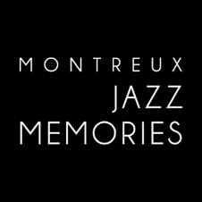

######################################
Montreux Jazz Memories
######################################

1 Introduction
**************

1.1 But du projet
=================
Créer une base de données SQL, un sytème de transcription de fichiers audios ainsi qu'une interface pour intéragir entre les deux.

1.2 Aperçu des étapes
=====================

* Remise et présentation du projet: 1er juin 2022

1.3 Equipe et responsabilités
==============================

* Zakari Rabet (`Zakari-Yacine.Rabet@unil.ch`_):
.. _Zakari-Yacine.Rabet@unil.ch: mailto:Zakari-Yacine.Rabet@unil.ch

	- Base de données
	- Code
	- Tests

* Johan Cuda (`johan.cuda@unil.ch`_):
.. _johan.cuda@unil.ch: mailto:johan.cuda@unil.ch

	- Transcription
	- Code
	- Ouverture du compte GitHub
	- Tests

* Lara Lambelet (`lara.lambelet.1@unil.ch`_):

.. _lara.lambelet.1@unil.ch: mailto:lara.lambelet.1@unil.ch

	- Cahier des charges/Rapport final
	- Gantt Chart
	- Interface Figma pour maquettes
	- Code Flask front-end
	- Documentation/Readme

2. Technique
************

2.1 Dépendances
===============

* 

* 

2.2 Fonctionnalités
=============================

.. image:: images/

* Charger un fichier audio.

* Remplir les données liées à l'audio.

* Bouton Transcribe permet de lancer la transcription de l'audio et rajouter le nouvel interview traité dans la base de données.

2.5 Tests
=========

TODO

3. Installation/User guide
*********

3.1 Version alpha
=================
* L'interface graphique est complètement construite.
* Les fonctionnalités minimales sont prises en charge par le logiciel et ont été testées.

3.2 Remise et présentation
==========================
* Les fonctionnalités principales sont complétement prises en charge par le logiciel.
* La documentation du logiciel est complète.
* Les fonctionnalités principales (et, le cas échéant, optionnelles) sont implémentées et ont été testées.

4. Infrastructure
=================
Le projet est disponible sur GitHub à l'adresse: TODO