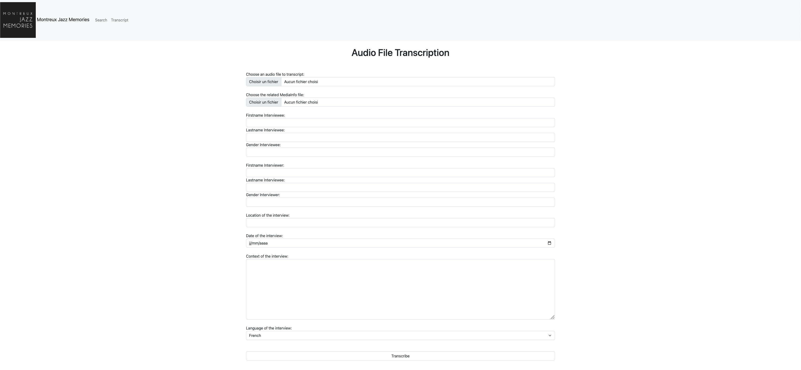
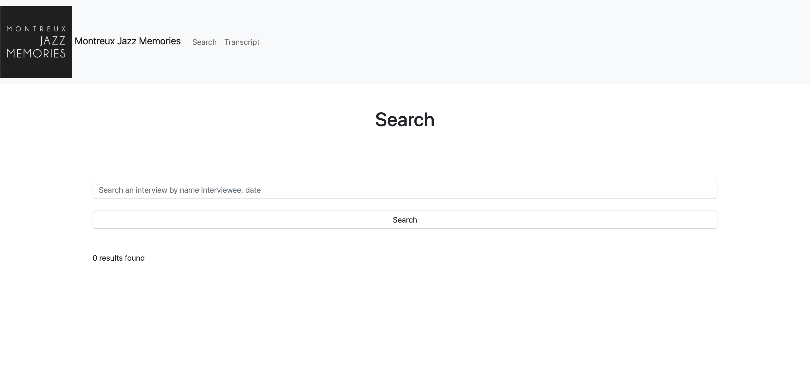
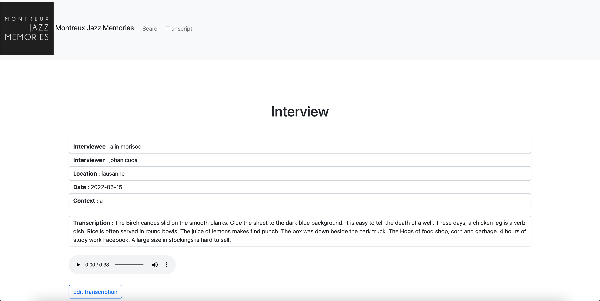

######################################
Montreux Jazz Memories
######################################

.. image:: images/logo.png

1 Introduction
**************

1.1 But du projet/Goal of the project
=====================================

Créer un sytème de transcription de fichiers audios wav, une base de donnée SQL ainsi qu'une interface permettant la recherche et la modification de transcriptions.

Create a transcription system for audio wav files, an SQL database and an interface for searching and editing transcriptions.

1.2 Aperçu des étapes/Overview of the steps
===========================================

* Remise et présentation du projet: 1er juin 2022/Submission and presentation of the project: June 1, 2022.

1.3 Equipe et responsabilités/Team and responsibilities
=============================

* Zakari Rabet (`Zakari-Yacine.Rabet@unil.ch`_):
.. _Zakari-Yacine.Rabet@unil.ch: mailto:Zakari-Yacine.Rabet@unil.ch

	- Création de la base de données/Creation of the database
	- Code
	- Tests

* Johan Cuda (`johan.cuda@unil.ch`_):
.. _johan.cuda@unil.ch: mailto:johan.cuda@unil.ch

	- Système de transcription/Transcription system
	- Code
	- Ouverture du compte GitHub/Opening a GitHub account
	- Tests

* Lara Lambelet (`lara.lambelet.1@unil.ch`_):

.. _lara.lambelet.1@unil.ch: mailto:lara.lambelet.1@unil.ch

	- Rapport final/Final Report
	- Gantt Chart
	- Interface Figma pour maquettes/Figma interface for prototypes
	- Code Flask front-end
	- Readme

2. Technique
************

2.1 Dépendances/Dependencies
===============

* Se référer au fichier requirements.txt/Refer to the requirements.txt file

* MySQL 5.7.24

* MAMP

* Python 3.8 or 3.9

* API Google Cloud Speech

2.2 Fonctionnalités
===================

* Charger un fichier audio/Load an audio file.

* Remplir les méta-données liées à l'audio/Fill in the metadata related to the audio.

* Effectuer la transcription et la stocker dans la base de données/Execute the transcription and store it in the database.

* Rechercher les transcriptions existantes dans la base de données/Search for existing transcripts in the database.

* Éditer les transcriptions/Edit transcripts.

3. User guide
==============

* Installer MAMP sur son appareil/Install MAMP on your device.
* Lancer les serveurs dans MAMP/Launch the servers in MAMP.
* Accéder à PHPmyadmin depuis MAMP/Access PHPmyadmin from MAMP.
* Copier - coller le contenu du fichier "MJM database.sql" dans phpmyadmin et l'exécuter/Copy - paste the content of the file "MJM database.sql" into phpmyadmin and run it.
* Ouvrir l'application/Open the application.
* Installer le fichier "requirements.txt"/Install the "requirements.txt" file.
* Lancer l'application/Run the application.

4. Infrastructure
=================

Le projet est disponible sur GitHub à l'adresse: https://github.com/Bawoup/Montreux-Jazz-Memories.git

The project is available on GitHub at: https://github.com/Bawoup/Montreux-Jazz-Memories.git